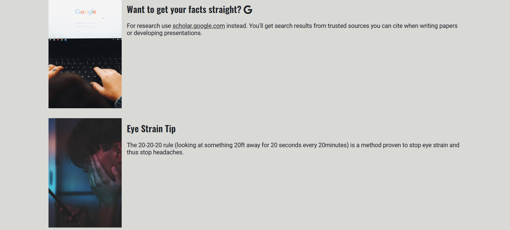

<h1 align="center">Life Hacks 101</h1>

[View the live project here.](https://jjconway23.github.io/html-css-project-1/index.html)

This is a life hacks website, which shares with its users interesting, informative and some educational life hacks. It has a home page, a dedicated page with 10 different life hacks and a contact us page. The contact us page is where visitors to the site can get in sign up to get alerted when a new life hack is added. It was designed responsively so devices from phones to monitors can view them.

<h2 align="center"></h2>

## User Experience (UX)

-   ### User stories

    -   #### First Time Visitor Goals

        1. As a First Time Visitor, I want to easily understand the main purpose of the site and learn more about what the site has to offer
        2. As a First Time Visitor, I want to be able to easily navigate throughout the site to find content.
        3. As a First Time Visitor, I want to look for quality information on each individual life hack and a picture to give the content more meaning. I also want to locate their social media links and ensure they open within a new tab keeping website number one focus.

    -   #### Returning Visitor Goals

        1. As a Returning Visitor, I want to new life hacks.
        2. As a Returning Visitor, I want to use the registration form to be alerted when new life hacks are added.

    -   #### Frequent User Goals
        1. As a Frequent User, I want to check to see if there are any newly added life hacks.

-   ### Design
    -   #### Colour Scheme
        -   The three main color schemes are black grey and white.
    -   #### Typography
        -   Two google fonts were used in making this website. Oswald for the headings and roboto for the rest of the text across the website. Sans Serif as the fallback font in case for any reason the font isn't being imported into the site correctly. 
    -   #### Imagery
        -   I have a large hero video that covers the screen on the home landing page. The video chosen will most definitely catch the eye of the visitors to the site. It give will give the site a modern and creative feel.

## Features
### Home Page

#### Navigation
- Positioned at the top of the page. On the left it has the site name along Life Hacks 101 along with the slogan sligtly below it. 
- To the right it has the three main pages of the site. Home Life Hacks and Sign Up. With an underline under the current page the visitor is on.

#### Trending Life Hacks Section  
- This section has three different life hacks showing. Each life hack has a picture, title and a description.
- Each is accompanied by a read more button. Which will take them to the life-hacks.index page and to the life hack they clicked read more on.

#### Life Hacks Page
### Navigation
- Every other page except from the home page has a standard nav bar without the hero video.
- The functionality and features of the header and nav remains the same.

### Life Hacks Content
- Life hacks page consists of 10 different life hacks
- Each life hack has a picture, heading and paragraph detailing what the life hack is about.
- Some life hacks also include the use of font awesome fonts for added emphasis.

#### Sign Up Page
- The sign up page allows visitors to the site to and get alerts when a new life hack is added to the site.
- It consists of fields for visitor to enter; full name, email, phone number, gender and age group.
- It has a submit button which is responsive and has an animation which scales the size slightly when you hover over it.

#### Footer
- The footer has links which use font awesome fonts for facebook, youtube, twitter and instagram accounts.
- When links are clicked on they open our social media accounts in a new tab.

### Languages Used

-   [HTML5](https://en.wikipedia.org/wiki/HTML5)
-   [CSS3](https://en.wikipedia.org/wiki/Cascading_Style_Sheets)

### Frameworks, Libraries & Programs Used

1. [Google Fonts:](https://fonts.google.com/)
    - Google fonts were used to import the 'Roboto' and 'Oswald' font into the style.css file which is used on all pages throughout the project.
1. [Font Awesome:](https://fontawesome.com/)
    - Font Awesome was used on all pages throughout the website to add icons for aesthetic and UX purposes.
1. [Git](https://git-scm.com/)
    - Git was used for version control by utilizing the Gitpod terminal to commit to Git and Push to GitHub.
1. [GitHub:](https://github.com/)
    - GitHub is used to store the projects code after being pushed from Git.

## Testing

The W3C Markup Validator and W3C CSS Validator Services were used to validate every page of the project to ensure there were no syntax errors in the project.

### HTML Validator
- 
- 
- 

### CSS Validator

-   [W3C CSS Validator](https://jigsaw.w3.org/css-validator/#validate_by_input) - [Results](http://jigsaw.w3.org/css-validator/validator?uri=https%3A%2F%2Fjjconway23.github.io%2Fhtml-css-project-1%2Findex.html&profile=css3svg&usermedium=all&warning=1&vextwarning=)

### Testing User Stories from User Experience (UX) Section

-   #### First Time Visitor Goals

    1. As a First Time Visitor, I want to easily understand the main purpose of the site and learn more about the organisation.

        1. Upon entering the site, users are automatically greeted with a clean and easily readable header and navigation bar to go to the page of their choice. This sits on top of the hero video.
        2. The main points are made by scrolling further down the page and seeing some of the trending hacks.
        3. The user can either scroll down and access the life hacks page by going clicking the read more button. Or going to the life hacks page through the navigation link.

    2. As a First Time Visitor, I want to be able to easily be able to navigate throughout the site to find content.

        1. The website is fluid, designed with UX at the top of my priorities. Each page has  navigation bar, each link descriptive and is designed so that the user can easily remember the design of my page after a couple clicks.
        2. At the bottom of each page there is links to our social media accounts.

    3. As a First Time Visitor, I want to look for a link directing me to what ive come to the site for. Life Hacks.
        1. Once the new visitor has arrived on the page they are immediately met with a header that explains what the site is for. Visitor can also scroll down and be greeted by trending life hacks. Also can be directed to the life hacks page by the cool nav bar that was designed.
        2. The user can also scroll to the bottom of any page on the site to locate social media links in the footer.
        3. At the bottom of the Contact Us page, the user is told underneath the form, that alternatively they can contact the organisation on social media which highlights the links to them.

-   #### Returning Visitor Goals

    1. As a Returning Visitor, I want to find out how i can sign up to be alerted about more life hacks

        1. Responsive sign up form can be accessed through the sign up link within the navigation bar clearly stating what that page is for.
    

-   #### Frequent User Goals

    1. As a Frequent User, I want to check if there are new life hacks added.

        1. The user would easily remember how to navigate through the site to check the life hacks page.

### Further Testing

-   The Website was tested on Google Chrome, Internet Explorer, Microsoft Edge browsers.
-   The website was viewed on a variety of devices such as Desktop, Laptop, iPhone 7, iPhone 12.
-   A large amount of testing was done to ensure that all pages were linking correctly.
-   Elderly family members were asked to attempt to navigate through site and done so with ease.

### Known Bugs

-   On some mobile devices the nav bar is pushed slightly more inward. Corrected by reducing margin slightly.
-   Submit button on iPhone was functional but was blue instead of intended color seen on rest of devices

## Deployment

### GitHub Pages

The project was deployed to GitHub Pages using the following steps...

1. Log in to GitHub and locate the [GitHub Repository](https://github.com/)
2. At the top of the Repository (not top of page), locate the "Settings" Button on the menu.
3. Scroll down the Settings page until you locate the "GitHub Pages" Section.
4. Under "Source", click the dropdown called "None" and select "Master Branch".
5. The page will automatically refresh.
6. Scroll back down through the page to locate the now published site [link](https://github.com) in the "GitHub Pages" section.

## Credits

### Code

-   The full-screen hero image code came from this [Pexels](https://www.pexels.com/)

### Content

-   All content was written by the developer.

### Media

-   Images and hero video were open source and taken from [Pexels](https://www.pexels.com/)

### Acknowledgements
- Kevin Powells Youtube videos
-   Tutor support at Code Institute for their support.
- W3c
- Scrimba
- Codecademy
